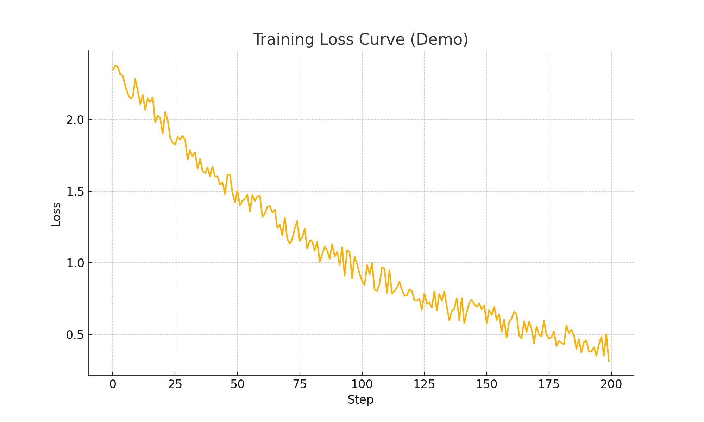

# Mini GPT Clone

A lightweight GPT-style transformer built **from scratch in PyTorch**.  
This project implements a character-level language model capable of learning small text datasets and generating new sequences.  

It’s designed as a **learning + research project** to explore how GPT-style models work under the hood.

---

## Features
- Character-level tokenization
- Embeddings for tokens + positions
- Transformer encoder layers with multi-head self-attention
- Training loop with cross-entropy loss
- Text generation with sampling
- Jupyter notebook for training visualization

---

##  Installation
Clone the repo and install dependencies:

```bash
git clone https://github.com/jbenasso/mini-gpt-practice.git
cd mini-gpt-clone
pip install -r requirements.txt
```

---

##  Usage
Run training + generation directly:
```bash
python main.py
```

Or explore the Jupyter notebook:
```bash
jupyter notebook notebooks/demo.ipynb
```

---

##  Example Results
Training on the string `"hello world"`:

```
Step 0, loss: 2.3031
Step 50, loss: 1.8294
Step 100, loss: 1.4217
Step 150, loss: 1.2113
```

Loss curve:  



Generated output after training:
```
Generated: helloworlddlrheoworlh
```

---

## Research Connections
- Mimics the **core architecture** of GPT (embeddings → attention → feedforward → normalization).  
- Simplifies concepts so they can be understood without large-scale resources.  
- Can be extended to reproduce results from research papers on transformers.  

---

## Project Structure
```
mini-gpt-clone/
│── main.py             # Tiny GPT model + training
│── requirements.txt    # Dependencies
│── README.md           # Project overview
│── LICENSE             # MIT license
│── .gitignore          # Ignore cache/temp files
│── notebooks/          # Demo notebook with plots + generation
│── experiments/        # (Optional) hyperparameter experiments
│── training_loss.png   # Training loss visualization
```

---

## Future Work
- Extend to **word-level tokenization**
- Add **causal masking** for proper autoregressive training
- Train on larger datasets (e.g., Shakespeare)
- Implement **attention visualization**

---

